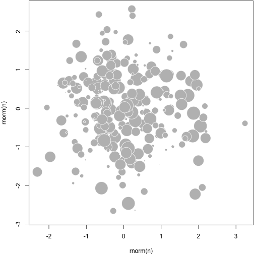

<!--
%\VignetteEngine{knitr::docco_classic}
%\VignetteIndexEntry{rebird vignette}
-->

# R Markdown with the Docco Linear Style

This is an example of Markdown vignettes using the [Docco style](http://jashkenas.github.io/docco/).

## Docco

To use the Docco style for Markdown vignettes in an R package, you need to

- add `*.Rmd` files under the `vignettes` directory
- add `Suggests: knitr` and `VignetteBuilder: knitr` to the `DESCRIPTION` file
- specify the vignette engine `\VignetteEngine{knitr::docco_linear}` in the `Rmd` files (inside HTML comments)

After building and installing the package, you can view vignettes via

```r
browseVignettes(package = 'Your_Package')
```

## Examples

Below are some code chunks as examples.


```r
cat('_hello_ **markdown**!', '\n')
```

_hello_ **markdown**! 

Normally you do not need any chunk options.


```r
1+1
```

```
## [1] 2
```

```r
10:1
```

```
##  [1] 10  9  8  7  6  5  4  3  2  1
```

```r
rnorm(5)^2
```

```
## [1] 0.058816 1.049229 0.005928 1.624432 2.121744
```

```r
strsplit('hello, markdown vignettes', '')
```

```
## [[1]]
##  [1] "h" "e" "l" "l" "o" "," " " "m" "a" "r" "k" "d" "o" "w" "n" " " "v"
## [18] "i" "g" "n" "e" "t" "t" "e" "s"
```

Feel free to draw beautiful plots and write math $P(X>x)=\alpha/2$.


```r
n=300; set.seed(123)
par(mar=c(4,4,.1,.1))
plot(rnorm(n), rnorm(n), pch=21, cex=5*runif(n), col='white', bg='gray')
```

 

## How does it work

The **markdown** package (>= v0.6.2) supports custom HTML templates, and the `docco` engine in **knitr** uses a custom template to compile Markdown to HTML:


```r
knit2html(..., markdown.HTML.template = system.file('misc', 'docco-template.html', package='knitr'))
```

That is it.
